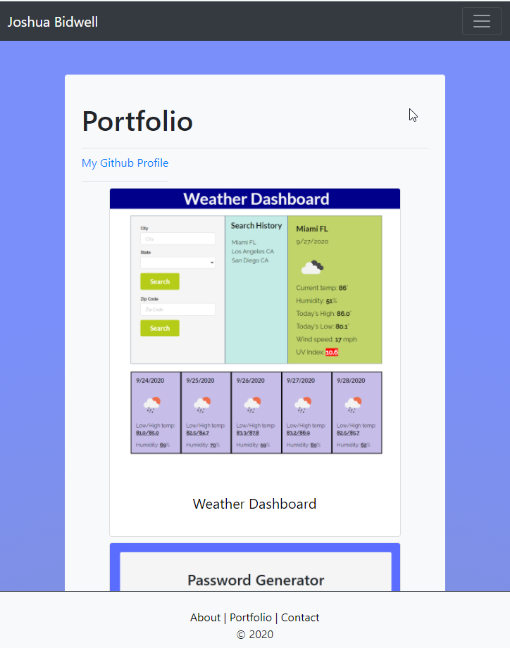

# React Portfolio

## Description

This is a refactoring of my previous portfolio so that it is now constructed using React.Js. The portfolio uses a React Router to navigate between pages, and uses components to populate every page.  

Every Page has a header with a dynamic navbar and a footer that also serves to navigate. The about and contact page are basic, they return simple HTML written in jsx. The portfolio uses a project component that uses a project array to populate the page using the map function. I am particularly happy with this because I was able to dynamically create rows and columns based on how many projects there are in the array. 

## Links 

GitHub Repository: https://github.com/jjbidwell/react-portfolio  
Deployed app: https://jjbidwell.github.io/react-portfolio/  

## Future Development  

There are a few things I'd really like to do to make this a fully-functioning portfolio: 
* Right now it's more of a proof of concept project in that the contact form doesn't actually do anything. I'd like to change that, but I'd have to set up some kind of backend, which I'd like to do.  
* I'd like to add my other projects to the page. 
* Right now my resume is on Google Docs, I'd like to host it, but I'm not 100% sure how to do that on React yet, so I'd like to learn how to do that so it looks a little more professional. 

## Screenshots 

  
  
  
